## Introduction

According to the 2018 August Linkedin Workforce Report [1], there is a roaring demand for workforces with data science skills across industries in the United States. As more institutions and industry sectors rely on big data to deal with operational challenges and optimize their decisions, the shortage of well-trained personnel in data science has been reported to be 151,717. Some regions are even in acute shortage, such as New York City, San Francisco, and Los Angeles. 

Given that graduate students entering into the job market with bachelor, master, or Ph.D. degree are actively seeking jobs locally or nationwide, we want to utilize the 7000 jobs posting information scraped from Indeed by Shanshan Lu on [Kaggle](https://www.kaggle.com/)  in order to investigate the data science job market in the U.S. Particularly, we are interested in geographic concentration of job opportunities, set of skills employers are expecting, and different qualifications and requirements for data science-related jobs. We are hoping this exploratory analysis will help students better tailor at their skill building and job hunting in the future.

We are inspired by the great analysis work done and the blog edited by Shanshan Lu posted on Kaggle. We shared some common interest in this dataset in terms of a wide array of qualifiers for getting a job in the field of data science. Beyond that, we launched our exploration from a general trend finding through data from National Occupational Employment Status and Wage Estimates from the US Bureau of Labour Statistics. Then we took a close look at the data from Indeed job posting. As we noticed this data includes companies and industries at differentiated levels. We brought the types of companies onto the table and mined through if the Fortune 500 U.S. companies and Non-Fortune 500 U.S. companies have different expectations of their candidates.

## Data and Method

### Source

The macroeconomic situation in data science industry embedded in background part were retrieved from the Bureau of Labour Statistics website [2]. We used both nation-wise and state-level [“Occupational Employment Statistics” data](https://www.bls.gov/oes/tables.htm)  from 2007 till 2017 to review the U.S. job market of data scientists in most recent 10 years. National datasets include the `number of total employment` aggregated for each year, `mean / median of hour and annual salary`, by different occupation categories. State-level data include two additional variables: `employment weights` and `location quotients` of a given occupation for each state. 

The data from the Bureau of Labour Statistics were already well-formatted when we accessed them, so the tidying of these data was trivial. Before any analysis, we resolved the inconsistency of occupation titles between different files and ensured that all variables have been converted to reasonable classes.   

Indeed data was scraped and cleaned by Shanshan Lu from Indeed website available on Kaggle[1](https://www.kaggle.com/). This dataset contains 7,000 data scientist jobs around the U.S. on August 3rd, 2018. Main variables include `Company Name`, `Position Name`, `Location`, `Job Description`, and `Number of Reviews of the Company`. We mainly squared at the job description column that contains information such as a short description of company and position, requirement and route of application.

Based on the ranking of total revenues of each company’s retrospective fiscal year, Fortune magazine's annual report of top 500 largest companies in the U.S has always been regarded as a reliable measurement for the value of a company [[3]](https://catalog.data.gov/dataset/fortune-500-corporate-headquarters). Many of the Fortune 500 companies now have a job title of Chief Data Scientist or Head of Analytics, and some Internet magnets have invested much in data mining, Artificial Intelligence or related areas. 

Given that differences of preference of these big-names and small companies may have for employees, we will combine the Fortune 500 company list and our Indeed dataset by company name. Through creating a new logical variable named `flag` to indicate whether each company falls into Fortune 500 companies category or not, this full dataset will be adopted for our Exploratory analysis. 

### Data Cleaning

__*Degree*__

One of our interests is degree requirement from job postings. Since the degree message is embedded in the job description column with a varying format, such as alternating letter cases and special characters. We predefined degree categories for applicants in pool. For Bachelor level we include bachelor, B.S., B.A., and a college degree, category Master including master, advanced and graduate degree, category PhD including Phd, MD, category high school by itself and others which do not contain information about degree requirement. We managed to be inclusive at this stage. We relied on functions from `stringr` package to specify the terms we are looking for while excluding some unmeaningful expression in the script. Some job description contains multiple degree qualification such as "bachelor, master, or higher education". We merely counted the frequency of each category across all job description. The rationale behind this is to assess a general requirement across occupations. 

__*Applicants Background*__

The related background we identified here are machine learning, statistics, math, quantitative, economics, biology, biostatistics, data science and chemical engineering. 

__*Software Tools*__

Next, we want to know what programming / statistical tools are most required by employers. We also use functions from `stringr `package, to extract the tool message from the job description column. One small problem here is that the message of some tools such as R or C, having only one single letter in its name, can be mixed with other words containing the same letter. So we combined some regular expressions, such as "\\b", to indicate the string we want to detect is completely separate. In the end, we identified 17 tools in total, including Python, R, SQL, Java, SAS, and so on.

__*Skills*__

We are also interested in what kinds of skills are most in need. In job description column, the skills listed in different job posts are numerous, trivial and diverse. We need to define the classification of skills first and then sort out the skill message. For example, communication skills, listening skills, team working, negotiation, emotional intelligence, conflict resolution, problem solving, decision making are mentioned dispersedly in different job posts, but they are all parts of interpersonal skills, so we detect all these messages and sort them into the category of Interpersonal Skills. In the end, we identified 10 major categories of skills, which were Machine Learning, Deep Learning, Data Manipulation & Analysis, Data Visualization, Data Mining, Modeling, Optimization, Artificial Intelligence, Interpersonal Skills, and Writing Skills.

__*Text Analysis*__

For the purpose of working with job description text stored as strings in R, we removed stop words from the text before we searched for words or phrases occurring at high frequency among the text. Occasionally throughout our navigating progress,  we have to adjust the stop words library in order to keep some case and letter sensitive word, for example, software languages R, C, or C++. 

## Results

#### Reviewing U.S. job market of data scientists in recent 10 years

The “Occupational Employment Statistics” data bases its classification of occupations on Standard Occupational Classification (SOC). According to this standard, we will refer one of the major categories “Computer and Mathematical Occupations" with SOC code “15-0000” to our occupation of interest “data scientists and data-science-related  professions”, for analysis based on this data in the following. 

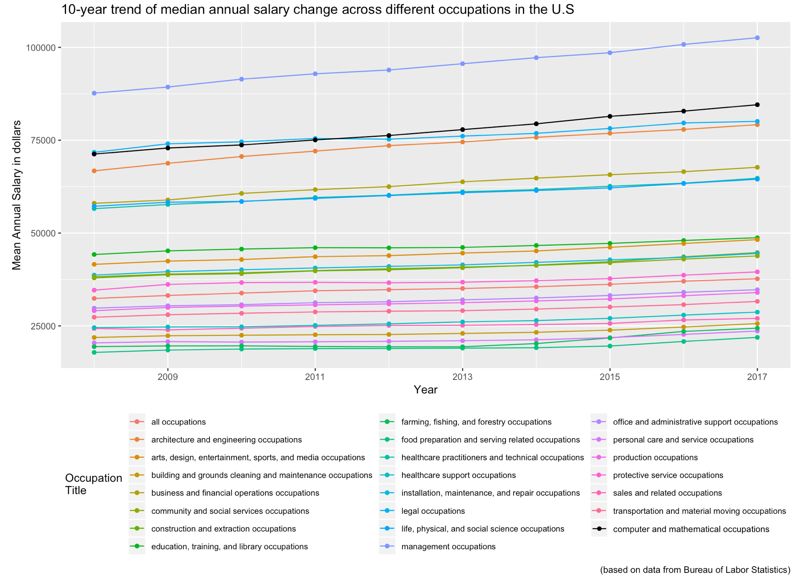{width = 80%}

Graph 1 compares the 23 major occupation groups (including the “all occupations” which represents the national average level) where the medians of annual salary of computer and mathematical occupations are plotted in black.  Ranked the second following “management occupations” since 2011, computer and mathematical-related professions are generally a well-paid working force community in the U.S. In recent 10 years, the median annual salary in this field raised from \$71270 to \$84560, with a greater percentage of increase than the national average salary. 

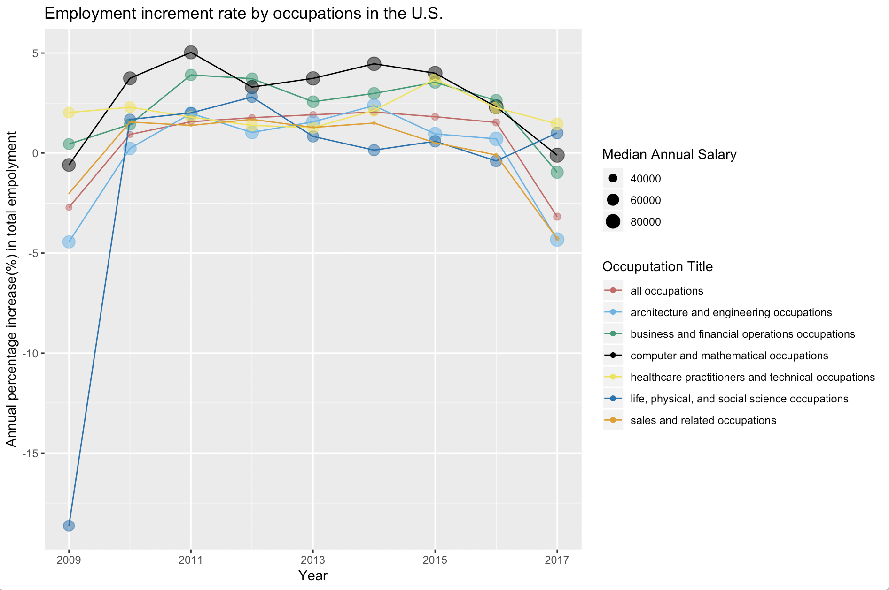
In Fig. 2, we reduced the occupations of interest down to 6 categories that generally require degree qualifications from higher education institutes and compared the increment rate of total employment number in recent 10 years. 

Though the median annual salary of data-science related professions follow a trend of steady increase in recent years, the number of total employment in this field since 2014 did not increase as fast as 2010 and 2011. Plotted in black in Fig. 2, the employment in computer and mathematical field has been increasing at a greater rate than many other professions that generally require qualifications from higher education. Even so, the rate dropped significantly after 2015 and reached below 0 in 2017. However we expected a national-wise burst of workforce in computer and mathematical occupations because there has been a national shortage of people with data science skills since 2015, according to the Linked Workforce Report. Possible explanations of the inconsistency between our result and the Linked report will be in the discussion session below. 

To sum up, the salaries of data-science-related professions increase at a steady rate over recent years. However, the total employment number since 2015 did not grow as fast as previous years and even decreased in 2017. 

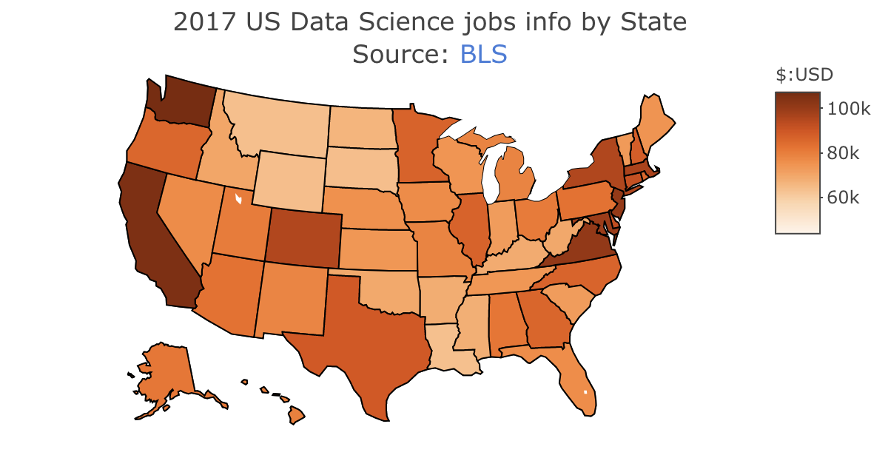{width=80%}

For carrying out a national level comparison in data science industry, we explored the salary profile which retrieved from Bureau of Labor Statistics. From the map, it vividly shows that there is a regional gap for salary levels in data science industry. The jobs with higher salaries-on par with the national average-are mainly concentrated in the Northeastern coastal states, Western coastal states and several central states. Among these states which offered great perks for employees, California, Washington state and northeastern states are traditionally more advanced with a large proportion of highly-educated residents and some of the most profitable companies. 

While there are also some conspicuous exceptions, Texas and Colorado state ranked high in terms of salaries, implying the potential growth for attracting more talented employees and scientists in the future. Given such a distribution in salaries in metropolitan areas, we recommend graduate students choose some high-tech hubs, like Silicon Valley, but they can also try to seek some opportunities in Texas or Colorado. 

#### Degree Preference

We start by the raw count of degree categories:

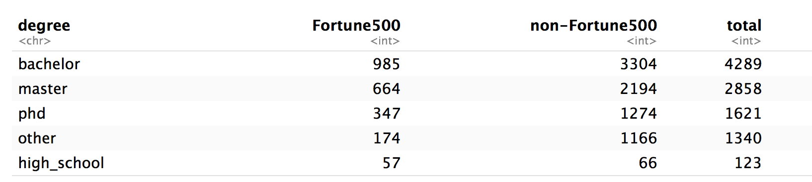

Observe: Under the total count, bachelor, master are mentioned most frequently across job descriptions. Those companies falling under the “other” category either do not contain information of degree we covered ahead or they might state their requirement in a different way than what we specified them to be.  

Then we compare the degree requirements between Fortune 500 industries in US and non-Fortune 500 companies. We calculated the log odds ratio of degree preferences in terms of word frequency for these two groups. 
[odds ratio degree word frequency]

We can observe that high school, master, bachelor, and Ph.D. degree are mentioned more frequently among Fortune 500 companies than non-Fortune  500 industries in this dataset. 

#### Desired Academic Background

The skills and toolset candidates can bring into the position are paramount at the consideration of recruiters. Based on prior knowledge, we predefined the fields as Statistics, Computer Science(including machine learning), Mathematics, Quantitative, Biology, Data Science, Economics, Physics, Biostatistics, MBA, and Chemical  Engineering. 

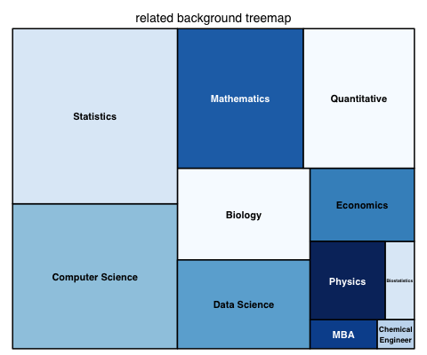  

Statistics, mathematics, computer science and quantitative take up almost two-thirds of the entire square panel. These words are at the heart root of this data science oriented field. However, the word “data science” does not appear as frequently as it might be supposed to be. Addiotionally, we also observe other enriched backgrounds like Biology, Economics and Physics. 

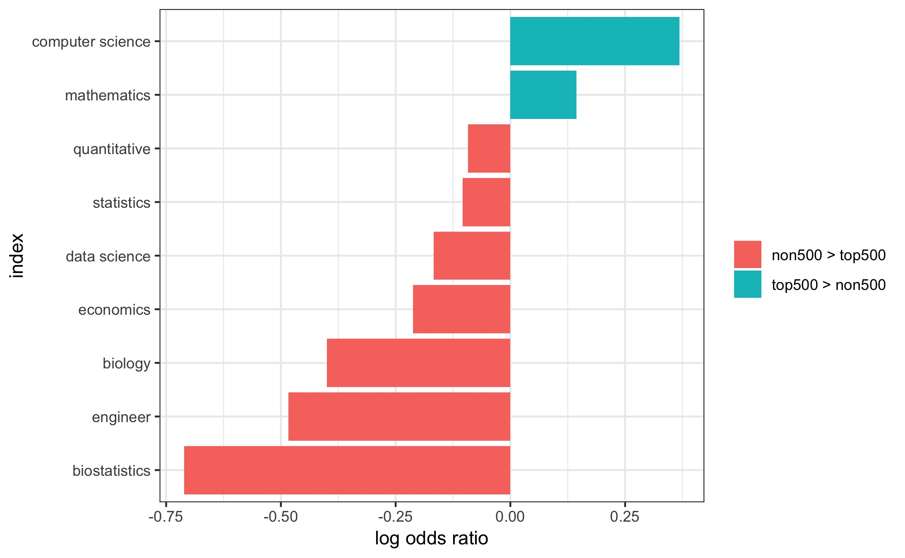

Fortune 500 companies prefer backgrounds with computer science and mathematics. Non-fortune 500 touched more on biostatistics, engineering and Biology. 

#### Most Required tools

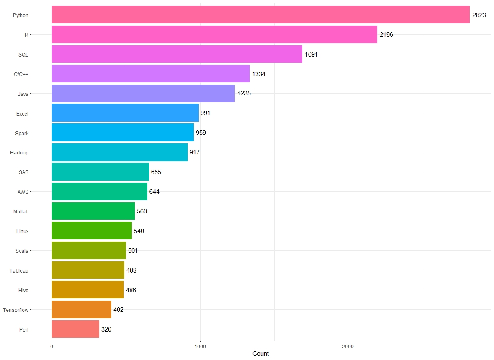{width=80%}

The most desired programming tools in job posts are Python, R and SQL. 

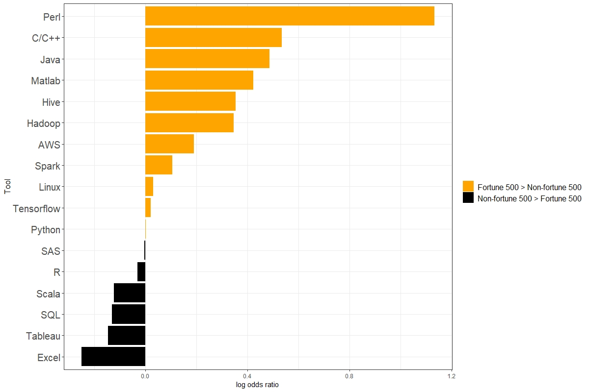{width=80%}

Compared with fortune 500 companies, non-fortune 500 companies mentioned Excel, Tableau and SQL more frequently in their job posts, while fortune 500 companies prefer candidates who mastering Perl, C/C++, and Java.

#### Most Required Skills

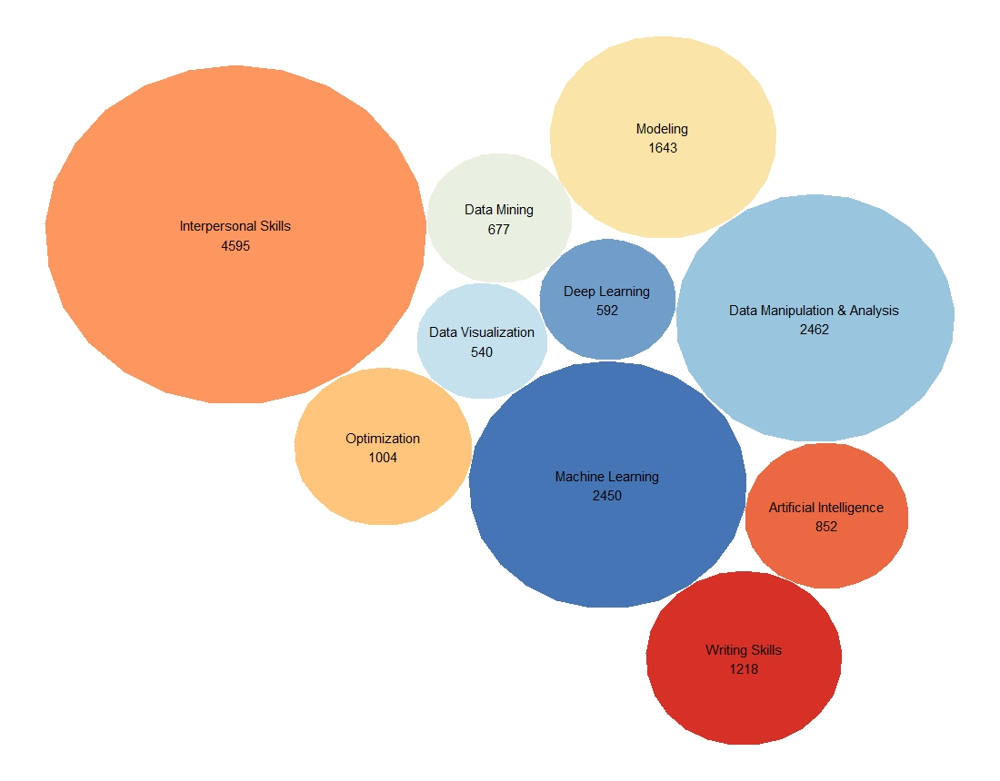{width=70%}

On the skill perspective, good interpersonal skills are in urgent need, followed by skills of data manipulation & analysis, machine learning and modeling. Non-fortune 500 companies mentioned writing skills, data visualization, and data manipulation & analysis more frequently in their job posts, while data mining, machine learning, artificial intelligence, deep learning, and modeling are much more favored by fortune 500 companies.

#### Job Description Text Analysis

Given that we have nearly 7000 full job descriptions posted on Indeed by employers, we aspire to navigate and visualize the most commonly used words across these descriptions. As we expected in the first place, degree requirements, related background, working ethics and culture in the company might show up at the top of the list. 

We counted the word frequencies in terms of a single word, double word, triple word and above. We are amazed to detect some words that are consistent with our expectation and those are not. 

We started with word count using window size one and displayed top 50 words below. 

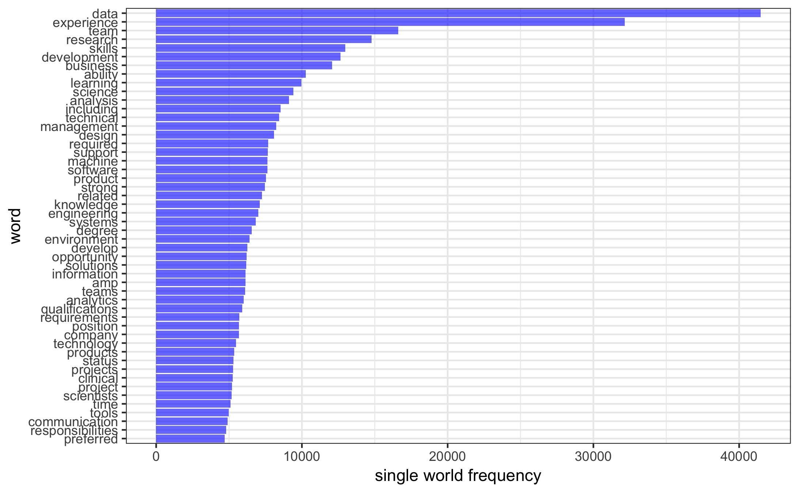{width=80%}

Not surprisingly, words such as "data", "experience", "team", "research" and "development" rank the top word counts throughout these job descriptions. This single word mining does not provide any informative message in its own right because of its lack of context. Our realizations are getting more intriguing as we gradually leverage window size because words will start making sense when they become at least a phrase.

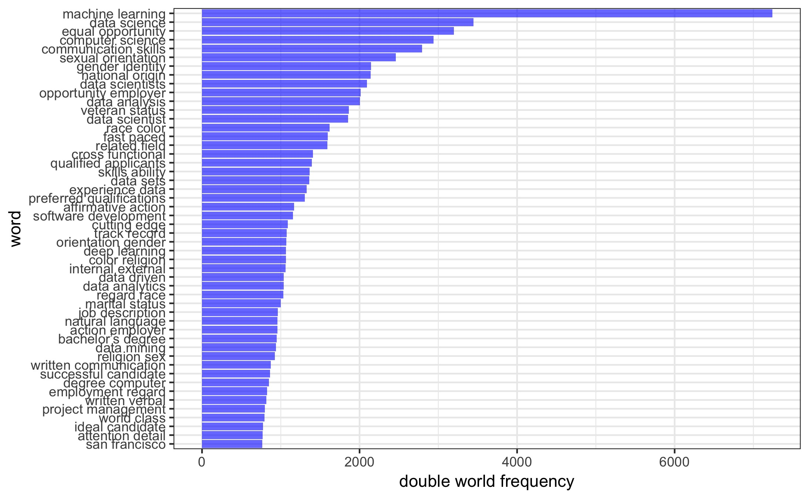{width=80%}

Here we see terms such as machine learning, data science, equal opportunity, computer science, communication skills, even San Francisco towards the end. These top 50 phrases generally can be categorized as software tools, interpersonal skills, and sociodemographic status information like gender identity, veterans status and marital status. Besides, some phrases captured are either redundant or not meaningful such as "religion sex" and "action employer". Considering that our window size is set to be 2 and the word tokens are separated into any two consecutive words in the text, not every output on the top rank will make perfect sense. Therefore we need to filter out some of those words and do analysis again. 

Since we know in advance that candidates' knowledge backgrounds, set of skills and degree are critical factors in the job application, for now, we remove socio-geographic information from the description. We display the top 50 words again after removing information such as race, sex, "requirement", "qualification", veteran status, marital status, etc.

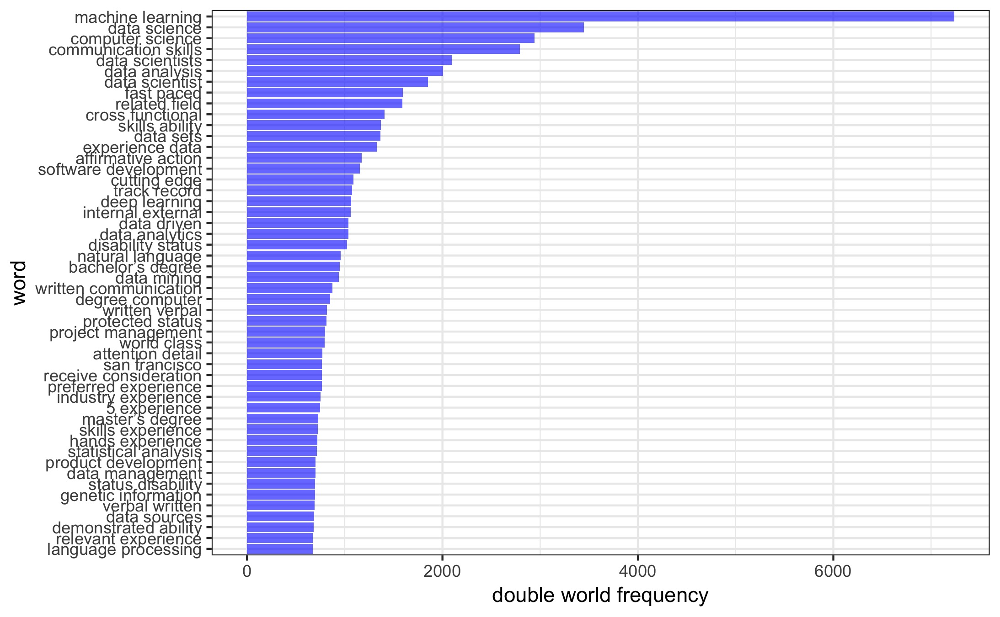{width=80%}

 "5 year experience", "hands experience", "master degree", "verbal written", "statistical analysis" show up on the top. Long term of experience with data is considerably desired by companies.  Five years of experience mentioned quite a lot in these descriptions.
 
Next, we set the window size to be three and four respectively, count the word frequency and display top 50 phrases. 

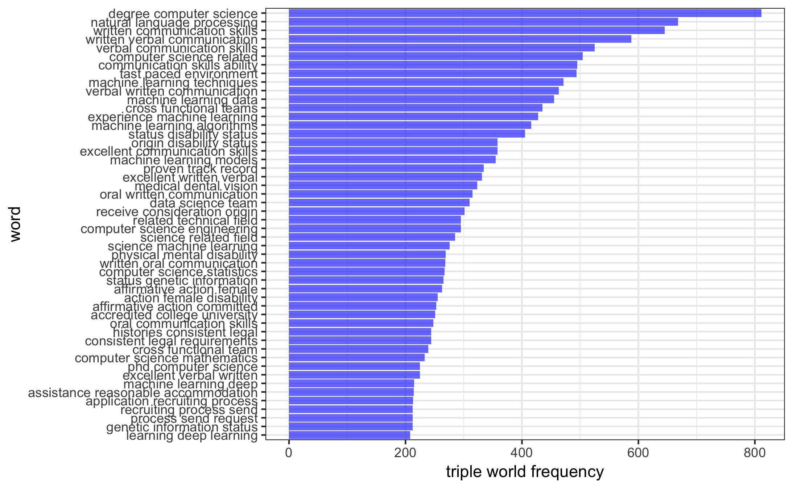{width=80%} 

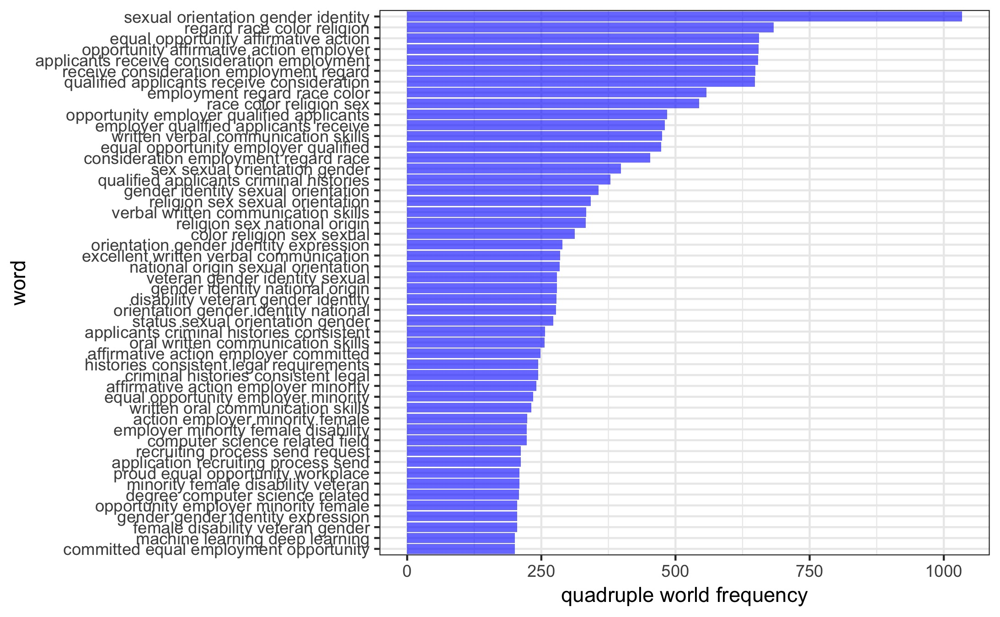{width=80%}

Most of the information standing out here is about sexual orientation, gender identity, and equal employment. Unexpectedly, the most frequent phrases are not related technical skills or any qualifications, but statements of equal opportunity employers, sexual orientation, race and religion. We also see phrases like computer science degree, machine learning techniques. From here we conclude that companies take equal consideration of candidates seriously in addition to the applicants’ qualified backgrounds.

## Discussion

If we examined the degree requirements, “high school” is most often observed in the job description and it has significantly greater log odds ratio when comparing the frequency appeared in Fortune 500 U.S  companies with those excluded. A careful interpretation of this is that high school is more likely to be the minimum degree requirement given that sometimes the degree preference is stated as “high school, master, or higher education.” This probably explains part of the reason why high school shows much more frequently in the job description of top 500 companies. A caveat here is that Fortune 500 U.S companies do not have lower requirement of degrees. Fortune 500 U.S  companies indeed mentions more frequently on master, bachelor and phd degree. Putting all these information together, we conclude that top 500 industries will make it clear of their degree requirement and prefer a degree of bachelor, master or Ph.D. than non Fortune 500 U.S companies. 

Data science is a hard-to-define field given its multidisciplinary nature across a wide array of subjects. Although a job seeker can enter this field with bare quantitative education, the employers, in fact, expect candidates with sufficient enough background with statistics, mathematics and computer science in order to accomplish tasks required on the job. Although they value the diversity in the workplace and allege to consider candidates with different background equally, having strong quantitative education will certainly add to the leverage. 

Explorations in most required tools and skills are really helpful to current job hunters, because the results will provide them with a rough idea of whether they will be preferable to most employees, and what they need to  improve in the remaining days. 

On the aspect of programming / statistical tools, Python, R and SQL are most required in job posts, which makes sense because, to a considerable extent, they are the most common tools in the fields of data science and statistics. Jump to the aspect of skills, interpersonal skills are mentioned most in job posts. Interpersonal skills, in other words, the ability to work well with others, are fairly basic for anyone to master but are of great importance to work efficiency. It is reasonable that employers would not recruit candidates with poor skills of communication, listening and team working, even if they have strong professional skills. Data manipulation & analysis, and machine learning are not surprising to rank second and third, respectively, because they are major solid skills that people can put to use in the field of data science.

The comparisons of required tools and skills between non-Fortune 500 and Fortune 500 companies provide us with really meaningful results. It appears that the non-Fortune 500 companies put their emphasis on regular data manipulation & analysis and mentioned general skills more frequently in their job posts. In contrast, the Fortune 500 companies require higher level programming tools (i.e., Perl, C/C++, JAVA) and desire their candidates to master much more advanced and professional data science skills (i.e. Data Mining, Machine Learning, Artificial Intelligence). It really makes sense because, in large corporations, data management is easier. Instead, you have more access to complex projects, for example, that application of machine learning algorithms on large datasets will become extremely complicated, which you cannot do this using regular tools. Results of this exploratory analysis might suggest new data scientists to start at larger companies because it would offer them more chances of improving their machine learning competencies, working on challenging data science projects, learning up-to-date knowledge in deep learning or some other cool algorithms.

Our additional text mining by window size from one to four help to illustrate that what we stressed above appear very frequently in the job posting including degree, related backgrounds, tools and skills prefered. But our findings are not limited these. Besides these technical skills, it’s also critical to have eloquent and efficient communication skills either verbal or writing because these jobs will mostly working with people. Employers also take equal opportunity seriously when they consider their candidates. 

Though our analysis on salary and employment counts focused on a macro point of view, the result can be reflective on individual levels. For people who are currently pursuing a career as a data scientist, it would be always beneficial to keep learning and practicing skills.

## Reference

[1]  Linkedin Economic Graph Team, ‘LinkedIn Workforce Report | United States | August 2018’, 2018, [Online]. Available: https://economicgraph.linkedin.com/resources/linkedin-workforce-report-august-2018. [Accessed: 07-Nov-2018].

[2] U.S. Bureau of Labour Statistics, ‘Occupational Employment Statistics’, 2018, [Online]. Available: https://www.bls.gov/oes/tables.htm. [Accessed: 09-Nov-2018]

[3] DATA.GOV, ‘Fortune 500’, 2018, [Online]. Available:  https://catalog.data.gov/dataset/fortune-500-corporate-headquarters. [Accessed: 13-Nov-2018]

