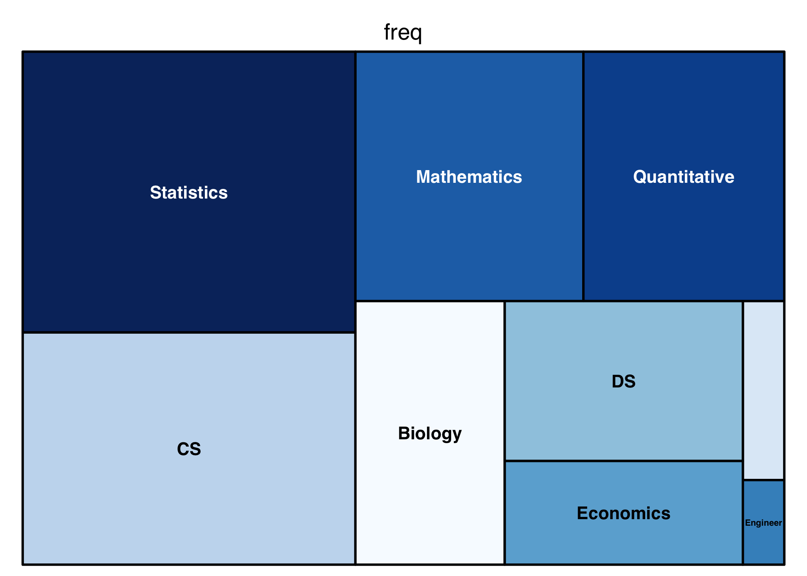

read data from Indeed
================

### read data (existing)

``` r
datascience <- read_csv("./data/datascience_market/alldata.csv") %>% 
  filter(!is.na(position))
```

### tidy datascience data

minimum requirement of degree

``` r
pattern_Hi = "[Hh]igh [Ss]chool"
pattern_Ba = "[Bb]achelor | \\bB\\.?A\\b | \\bB\\.?S\\b | [Cc]ollege | [Dd]egree"
pattern_Ma = "[Mm]aster[^y] | [Aa]dvanced | \\bM\\.?[SA]\\b | [Gg]raduate"
pattern_Phd = "\\b[Pp][Hh]\\.?[Dd]\\b | \\bM\\.?D\\b"

datascience %>% 
  mutate(degree = ifelse(str_detect(.$description, pattern_Hi) == TRUE, "high school",
                      ifelse(str_detect(.$description, pattern_Ba) == TRUE, "bachelor",
                          ifelse(str_detect(.$description, pattern_Ma) == TRUE, "master",
                               ifelse(str_detect(.$description, pattern_Phd) == TRUE, "phd", "other"))))) %>% 
  mutate(degree = factor(degree, levels = c("high school", "bachelor", "master", "phd", "other"))) %>% 
  ggplot(aes(x = degree)) + 
  geom_bar() + 
  labs(title = "Minimum degree requirement")
```


### word frequency count

Took 100 samples from 7000

``` r
datascience <- mutate(datascience, index = 1:nrow(datascience))
set.seed(1)
sample1 <- sample(1:nrow(datascience), 100, replace = FALSE)
sample1
```

    ##   [1] 1847 2588 3982 6313 1402 6243 6563 4590 4370  430 1431 1226 4769 2666
    ##  [15] 5342 3454 4979 6880 2636 5391 6481 1471 4517  871 1852 2675   93 2649
    ##  [29] 6023 2357 3338 4151 3416 1289 5725 4625 5494  747 5005 2844 5676 4473
    ##  [43] 5411 3822 3660 5453  162 3296 5057 4783 3298 5945 3024 1690  488  687
    ##  [57] 2182 3577 4565 2805 6293 2024 3164 2291 4484 1778 6906 5277  581 6026
    ##  [71] 2334 5778 2386 2297 3277 6137 6902 2682 5345 6604 2988 4897 2749 2236
    ##  [85] 5201 1393 4884  836 1686  984 1645  405 4407 6012 5343 5468 3122 2812
    ##  [99] 5559 4147

``` r
data_100 <- datascience[sample1,]
```

we’ll un-nest the tokens (i.e. words) in each description; the result is a tidy dataset in which each word is contained within a separate row.

word frequency in description

-   Single word

``` r
data(stop_words)
keep_letter_stop_words <- stop_words %>% filter(!word %in% c("C", "c", "R", "r"))

inspection_words_single = 
  datascience %>% 
  unnest_tokens(word, description) %>% 
  anti_join(x = ., keep_letter_stop_words)

inspection_words_single %>% 
  count(word, sort = TRUE) %>% 
  top_n(100) %>% 
  mutate(word = fct_reorder(word, n)) %>% 
  ggplot(aes(x = word, y = n)) + 
  geom_bar(stat = "identity", fill = "blue", alpha = .6) + 
  labs(y = "single world frequency") +
  coord_flip()
```



-   Double word

``` r
data(stop_words)
keep_letter_stop_words <- stop_words %>% filter(!word %in% c("C", "c", "R", "r"))

inspection_words = 
  datascience %>% 
  unnest_tokens(word, description) %>% 
  anti_join(x = ., keep_letter_stop_words)

inspection_words %>%
  nest(word) %>%
  mutate(text = map(data, unlist), 
         text = map_chr(text, paste, collapse = " ")) %>% 
  select(-data) %>% 
  unnest_tokens(word, text, token = "ngrams", n = 2) %>% 
  count(word, sort = TRUE) %>% 
  top_n(50) %>% 
  mutate(word = fct_reorder(word, n)) %>% 
  ggplot(aes(x = word, y = n)) + 
  geom_bar(stat = "identity", fill = "blue", alpha = .6) + 
  labs(y = "double world frequency") +
  coord_flip()
```


``` r
word_cloud2 <- inspection_words %>%
  nest(word) %>%
  mutate(text = map(data, unlist), 
         text = map_chr(text, paste, collapse = " ")) %>% 
  select(-data) %>% 
  unnest_tokens(word, text, token = "ngrams", n = 2) %>% 
  count(word, sort = TRUE) %>% 
  top_n(50) 

wordcloud(words = word_cloud2$word, freq = word_cloud2$n, random.order=FALSE,
          rot.per=0.35, colors=brewer.pal(8, "Dark2"))
```


-   Three words

``` r
inspection_words %>%
  nest(word) %>%
  mutate(text = map(data, unlist), 
         text = map_chr(text, paste, collapse = " ")) %>% 
  select(-data) %>% 
  unnest_tokens(word, text, token = "ngrams", n = 3) %>% 
  count(word, sort = TRUE) %>% 
  top_n(50) %>% 
  mutate(word = fct_reorder(word, n)) %>% 
  ggplot(aes(x = word, y = n)) + 
  geom_bar(stat = "identity", fill = "blue", alpha = .6) + 
  labs(y = "triple world frequency") +
  coord_flip()
```


-   four words

``` r
inspection_words %>%
  nest(word) %>%
  mutate(text = map(data, unlist), 
         text = map_chr(text, paste, collapse = " ")) %>% 
  select(-data) %>% 
  unnest_tokens(word, text, token = "ngrams", n = 4) %>% 
  count(word, sort = TRUE) %>% 
  top_n(50) %>% 
  mutate(word = fct_reorder(word, n)) %>% 
  ggplot(aes(x = word, y = n)) + 
  geom_bar(stat = "identity", fill = "blue", alpha = .6) + 
  labs(y = "quadruple world frequency") +
  coord_flip()
```


### Comparing words across groups
