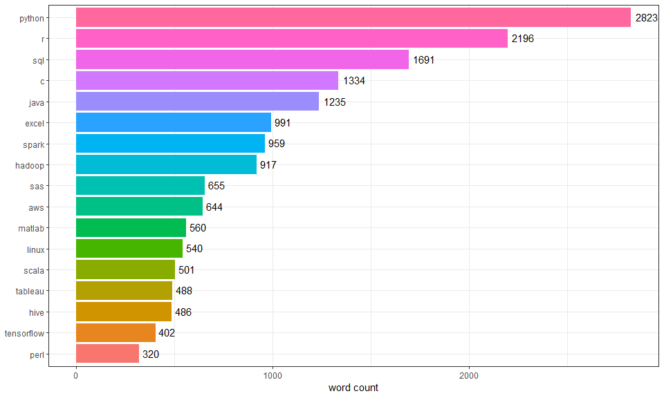
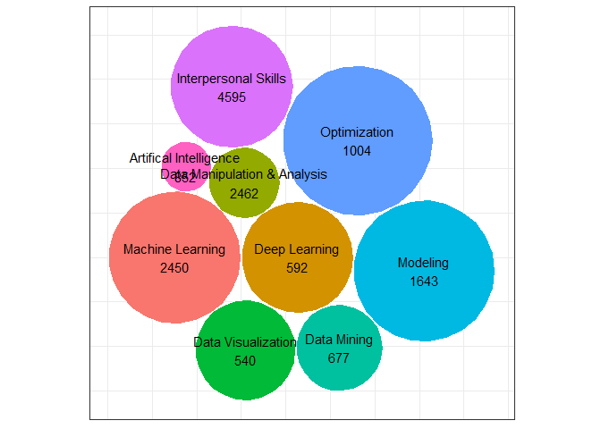

tool variable
================

``` r
datascience <- read_csv("./data/datascience_market/alldata.csv")
```

    ## Parsed with column specification:
    ## cols(
    ##   position = col_character(),
    ##   company = col_character(),
    ##   description = col_character(),
    ##   reviews = col_integer(),
    ##   location = col_character()
    ## )

Extract tool variable and plot

``` r
tool_new = datascience %>% 
  mutate(
    python = ifelse(str_detect(.$description,  c("\\b[Pp][Yy][Tt][Hh][Oo][Nn]\\b")) == TRUE, 1, 0),
    excel = ifelse(str_detect(.$description,  c("\\b[Ee][Xx][Cc][Ee][Ll]\\b")) == TRUE, 1, 0),
    r = ifelse(str_detect(.$description,  c("\\b[Rr]\\b")) == TRUE, 1, 0),
    sql = ifelse(str_detect(.$description,  c("\\b[Ss][Qq][Ll]\\b")) == TRUE, 1, 0),
    java = ifelse(str_detect(.$description,  c("\\b[Jj][Aa][Vv][Aa]\\b")) == TRUE, 1, 0),
    tableau = ifelse(str_detect(.$description,  c("\\b[Tt][Aa][Bb][Ll][Ee][Aa][Uu]\\b")) == TRUE, 1, 0),
    sas = ifelse(str_detect(.$description,  c("\\b[Ss][Aa][Ss]\\b")) == TRUE, 1, 0),
    matlab =  ifelse(str_detect(.$description,  c("\\b[Mm][Aa][Tt][Ll][Aa][Bb]\\b")) == TRUE, 1, 0),
    c = ifelse(str_detect(.$description,  c("\\b[Cc]\\b")) == TRUE, 1, 0),
    perl = ifelse(str_detect(.$description,  c("\\b[Pp][Ee][Rr][Ll]\\b")) == TRUE, 1, 0), 
    scala = ifelse(str_detect(.$description,  c("\\b[Ss][Cc][Aa][Ll][Aa]\\b")) == TRUE, 1, 0), 
    spark = ifelse(str_detect(.$description,  c("\\b[Ss][Pp][Aa][Rr][Kk]\\b")) == TRUE, 1, 0), 
    hadoop = ifelse(str_detect(.$description,  c("\\b[Hh][Aa][Dd][Oo][Oo][Pp]\\b")) == TRUE, 1, 0), 
    aws = ifelse(str_detect(.$description,  c("\\b[Aa][Ww][Ss]\\b")) == TRUE, 1, 0),
    hive = ifelse(str_detect(.$description,  c("\\b[Hh][Ii][Vv][Ee]\\b")) == TRUE, 1, 0),
    tensorflow = ifelse(str_detect(.$description,  c("\\b[Tt][Ee][Nn][Ss][Oo][Rr][Ff][Ll][Oo][Ww]\\b")) == TRUE, 1, 0),
    linux = ifelse(str_detect(.$description,  c("\\b[Ll][Ii][Nn][Uu][Xx]\\b")) == TRUE, 1, 0)
    )
```

``` r
tool_new %>% 
  select(python:linux) %>% 
  # sum of each column
  colSums(., na.rm = TRUE) %>% 
  as.tibble() %>% 
  # extract the row names (tool names) and set them as the value of first column
  cbind(tool = row.names(.), .) %>% 
  # clean the original row names
  `row.names<-.default`(1:17) %>% 
  rename(sum = value) %>% 
  mutate(tool = fct_reorder(tool, sum)) %>% 
  ggplot(aes(x = tool, y = sum, fill = tool)) +
  geom_col() +
  geom_text(aes(label = sum), hjust = -0.2, vjust = 0.4) +
  coord_flip() +
  labs(y = "word count") +
  theme(
    legend.position = "none",
    axis.title.y = element_blank())
```



Extract skill variable and plot (Are the classifications right?)

``` r
skill_new = datascience %>%
  mutate(
    machine_learning = ifelse(str_detect(.$description,  c("[Mm]achine [Ll]earning")) == TRUE, 1, 0),
    deep_learning = ifelse(str_detect(.$description,  c("[Dd]eep [Ll]earning")) == TRUE, 1, 0),
    # Data Manipulation & Analysis
    data_mani_ana = ifelse(str_detect(.$description,  c("[Dd]ata [Aa]nalysis|[Dd]ata [Mm]anipulation|[Dd]ata [Mm]anagement|[Dd]ata [Ee]valuation|[Ss]tatistical [Aa]nalysis|[Rr]egression")) == TRUE, 1, 0),
    # data visualization
    data_visul = ifelse(str_detect(.$description,  c("[Dd]ata [Vv]isualization")) == TRUE, 1, 0),
    data_mining = ifelse(str_detect(.$description,  c("[Dd]ata [Mm]ining")) == TRUE, 1, 0),
    modeling = ifelse(str_detect(.$description,  c("[Mm]odeling")) == TRUE, 1, 0),
    # include machine learning optimization, data optimization, mathematical optimization???
    optimization = ifelse(str_detect(.$description,  c("[Oo]ptimization")) == TRUE, 1, 0),
    # interpersonal skills
    interpersonal = ifelse(str_detect(.$description,  c("[Ii]nterpersonal [Ss]kill|[Cc]ommunication|[Ll]istening [Ss]kill|[Tt]eam [Ww]orking|[Nn]egotiation|[Ee]motional [Ii]ntelligence|[Cc]onflict [Rr]esolution|[Pp]roblem [Ss]olving|[Dd]ecision [Mm]aking")) == TRUE, 1, 0),
    # artifical intelligence
    arti_inte = ifelse(str_detect(.$description,  c("\\bAI\\b|[Nn]eural [Nn]etwork")) == TRUE, 1, 0)
  )
```

``` r
skill_new = skill_new %>% 
  select(machine_learning:arti_inte) %>% 
  # sum of each column
  colSums(., na.rm = TRUE) %>% 
  as.tibble() %>% 
  cbind(skills = c("Machine Learning", "Deep Learning", "Data Manipulation & Analysis", "Data Visualization", "Data Mining", "Modeling", "Optimization", "Interpersonal Skills", "Artifical Intelligence"), .$value) %>% 
  select(skills, sum = value) %>% 
  `row.names<-.default`(1:9)
  
# use packege`packcircles` to make bubble plot
packing <- circleProgressiveLayout(skill_new)
dat.gg <- circleLayoutVertices(packing)

plot_df <- cbind(skill_new, packing) 

plot_df$text2 <- paste0(plot_df$skills,"\n",plot_df$sum)

ggplot(data = dat.gg) +
  geom_polygon(aes(x, y, group = id, fill =  factor(id)), color = "white", show.legend = FALSE) +
  scale_y_reverse() +
  coord_equal() +
  geom_text(data = plot_df, aes(x, y,label = text2)) +
  theme(
    axis.title.x = element_blank(),
    axis.title.y = element_blank(),
    axis.ticks.x = element_blank(),
    axis.ticks.y = element_blank(),
    axis.text.x = element_blank(),
    axis.text.y = element_blank()
    )
```


